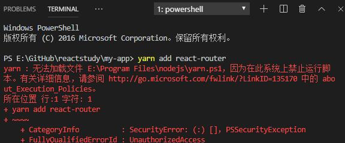

# 前端环境的配置

## 基本工具的安装

- Node.js 的安装 → [官网链接](https://nodejs.org/zh-cn/download/)
- git 的安装 → [下载地址](https://git-scm.com/downloads)
- cnpm || yarn 的安装
  > [cnpm 淘宝镜像](https://developer.aliyun.com/mirror/NPM?from=tnpm)【这是详细描述】  
  > [yarn 下载地址](https://yarn.bootcss.com/docs/install/#windows-stable) 【或者通过命令直接安装 npm i yarn -g】  
  > cnpm 只需要在 powershell 里面运行下面指令即可：
  >
  > > 在一个文件夹下，按住 shift，右击鼠标，就能打开基于当前文件夹的 powershell  
  > > 指令：npm install -g cnpm --registry=https://registry.npm.taobao.org
- vscode 的安装 → [vscode 下载地址](https://code.visualstudio.com/)

## 基本工具的安装的问题

- #### node-sass 的错误【主要是 node-sass 的依赖包地址的问题】
  > 命令行里直接输入指令 npm config set sass_binary_site https://npm.taobao.org/mirrors/node-sass/
- #### event.js error 的错误【表示端口占用】
  > 去计算机的环境变量里面的用户变量的 Path 里增加 C:\Windows\System32

## cnpm || yarn 安装后运行时候的问题

<font color=red>因为在此系统上禁止运行脚本报错</font>



- 打开 windows 的搜索，输入 powershell，找到 windows PowerShell，右击管理员身份运行
- 输入命令： set-ExecutionPolicy RemoteSigned
- 按照界面意思 输入 Y，然后就可以运行 cnpm || yarn 的指令了

## 拉取前端 git 库的代码

- 找后端或者其他相关人员配置 git 的权限
- git clone [git 地址](http://gitlab.ggn.top/web/saas-admin.git) 进行代码拉取
- 需要的话 可以配置 ssh
- git checkout dev 切换到 dev 分支进行开发

## 配置开发环境

- 进入到【项目目录】
- 在当前目录按住 shift，鼠标右击，点击【在此处打开 powershell 窗口】
- 安装项目需要的依赖 yarn || npm install || cnpm install 【三种方式自己选择】，会出现 node_modules 文件夹
- 开发环境运行命令 → 在 powershell 窗口中 yarn serve || npm run serve || cnpm run serve 【三种方式自己选择】
- 打包运行命令 → 在 powershell 窗口中 yarn build || npm run build || cnpm run build 【三种方式自己选择】

## 运行后的问题

- #### Network unavailable
  > 如果启动后有 localhost:端口，但是下面出现 network unavailable, 表示没有获取到计算机的 IP，可以在 vue.config.js 里面的 devServer 里面加一个 public

```js
devServer: {
    host: '0.0.0.0',
    port: port,
    open: true,
    public: `http://192.168.1.50:${port}`,  // 加这一行
    proxy: {
      [process.env.VUE_APP_BASE_API]: {
        target: `http://192.168.10.73:8080`,
        // 这个是后端接口的地址，这个要修改成你本地的接口地址
        changeOrigin: true,
        pathRewrite: {
          ['^' + process.env.VUE_APP_BASE_API]: ''
      }
    }
},

```

<!-- ## 测试环境的部署
- 找相关人员配置jenkins的权限
- 执行前，先确认项目中是否存在dist文件夹,dist里的就是打包后的文件
- 然后打开[jenkins的地址](http://10.168.1.186:8082/)，定位 前端分支：datashow-demo，点击下拉，执行Build Now即可 -->

## 后端人员配置本地前端

- 同样 Nodejs 必须安装，配置下淘宝镜像 cnpm || yarn
- git clone 前端的项目，放到本地的文件夹
- 进入到项目根目录，运行 cnpm install || yarn 安装依赖，可参考【配置开发环境】
- 修改根目录下的【vue.config.js】里面的 proxy(代理)，改成你本地的接口地址【http://127.0.0.1/port(端口)】

```js {4}
devServer: {
    proxy: {
      '/jeecg-boot': {
        target: `http://127.0.0.1:8080`,
        // 这个是后端接口的地址，这个要修改成你本地的接口地址
        ws: true,
        changeOrigin: true
      }
    }
},
```
- 运行cnpm run serve || yarn serve, 启动项目，就可以看到效果了
- #### 上面启动命令的serve不是一成不变的，是根据package.json里面的scripts的里面的key决定的