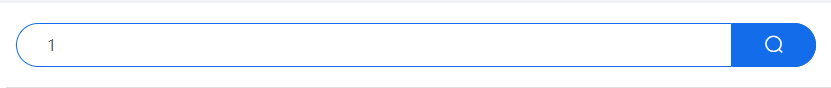
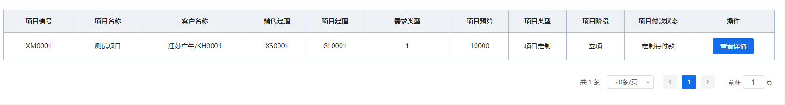
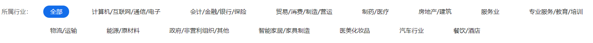
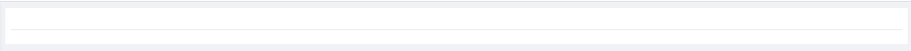
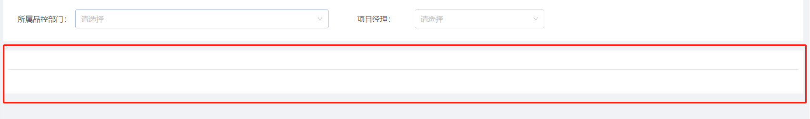
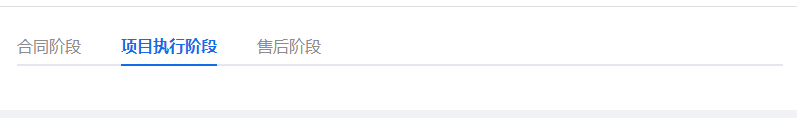
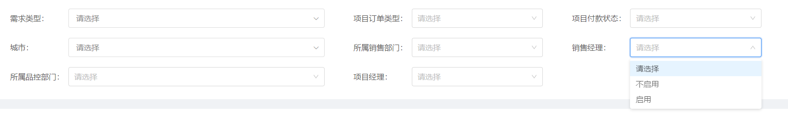
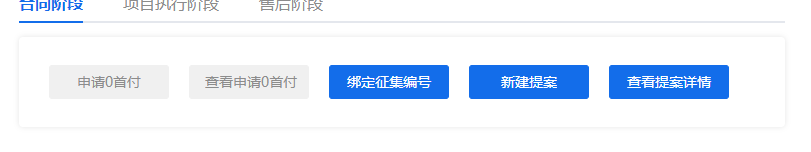
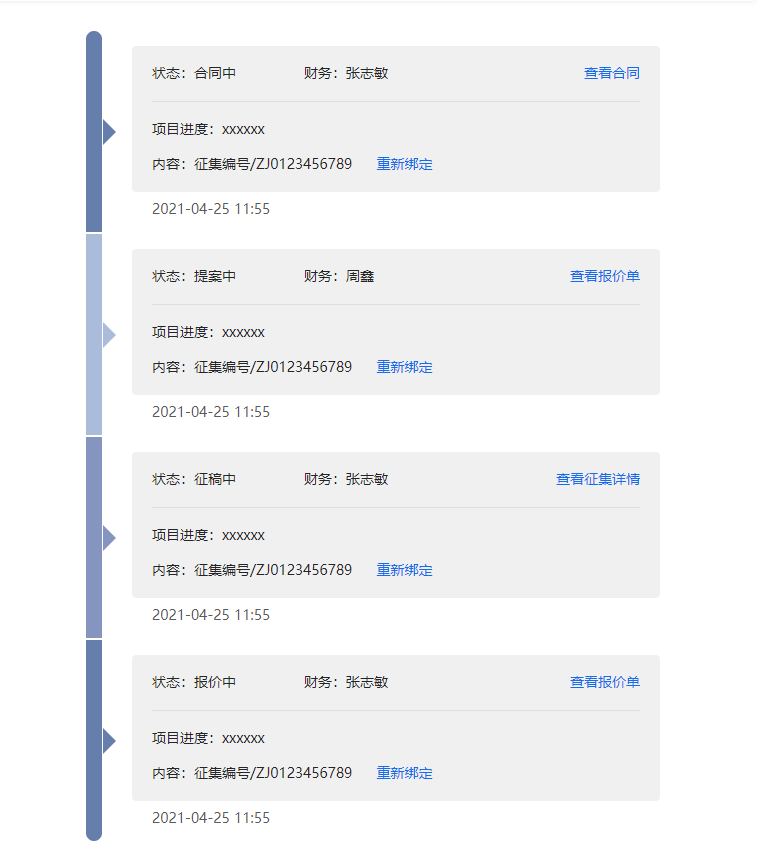

# 项目管理组件

## 项目管理列表的搜索输入框

::: tip 组件路径(不用局部引入)
@sass/components/common/SearchInput.vue
:::


| 组件属性 / emit 事件 |   类型   |          说明          |
| -------------------- | :------: | :--------------------: |
| value                |  String  |       输入框的值       |
| @result              | Function | 向父组件传值(搜索的值) |

> 如果组件属性比较复杂，可以在这里展示具体的格式

```js
// 组件属性
```

> 使用展示：

```js
<sass-search-input :value="searchCont" @result="(val)=>setSearch('searchCont',val)">
</sass-search-input>
```

## 通用表格组件

::: tip 组件路径(不用局部引入)
@sass/components/common/CommonTable.vue
:::



| 组件属性 / emit 事件 |   类型   |                       说明                       |
| -------------------- | :------: | :----------------------------------------------: |
| data                 |  Array   |                    表格的数据                    |
| columnList           |  Array   |                     列的数组                     |
| pageInfo             |  Object  |                     分页数据                     |
| @refresh             | Function | 分页改变当前页和 size 变化都会触发列表刷新的事件 |

> 数据格式 介绍(columnList | pageInfo)

```js
// 组件属性 columnList
columnList: [
    {
      label: "项目编号", // 列文本
      prop: "projectCode", //属性
      width: 140 // 宽度
    },
    {
      label: "项目名称",
      prop: "projectName",
      width: 140,
      custom: true
      // 是否自定义，slot插槽,slot的name就是prop,插槽作用域的属性名字是row
    },
    {
      label: "客户名称",
      prop: "companyName",
      width: 220,
      custom: true
    },
    {
      label: "销售经理",
      prop: "saleManagerCode",
      width: 120
    },
    {
      label: "项目经理",
      prop: "projectManagerCode",
      width: 120
    },
    {
      label: "需求类型",
      prop: "requireType",
      width: 180
    },
    {
      label: "项目预算",
      prop: "projectBudgetStart",
      width: 120
    },
    {
      label: "项目类型",
      prop: "projectType",
      width: 120,
      custom: true
    },
    {
      label: "项目阶段",
      prop: "projectPhase",
      width: 120,
      custom: true
    },
    {
      label: "项目付款状态",
      prop: "payStatus",
      width: 140,
      custom: true
    },
    {
      label: "操作",
      prop: "operate",
      width: 170,
      custom: true
    }
]
// 组件属性 pageInfo
pageInfo: {
  page: 1, //当前页
  size: 20, // 一页多少个
  total: 0, //总共个数
},
// size的数组默认是[10, 20, 40, 50],需要扩展的话再说
```

> 使用展示：

```js
<sass-common-table
  :data="tableData"
  :column-list="columnList"
  :page-info="pageInfo"
  @refresh="getData"
>
  // v-slot都是slot插槽，用于自定义
  <template v-slot:projectName="slotProps">
    <span :title="slotProps.row.projectName">{{ slotProps.row.projectName | cutLength }}</span>
  </template>

  <template v-slot:companyName="slotProps">
    {{`${slotProps.row.companyName}/${slotProps.row.customerCode}`}}
  </template>

  <template v-slot:projectType="slotProps">
    // 这里用了字典过滤器，@sass/utils/filter里面
    <span>{{ slotProps.row.projectType | dict('project_type') }}</span>
  </template>

  <template v-slot:payStatus="slotProps">
    <span>{{ slotProps.row.payStatus | dict('project_pay_status') }}</span>
  </template>

  <template v-slot:projectPhase="slotProps">
    <span>{{ slotProps.row.projectPhase | dict('project_phase') }}</span>
  </template>

  <template v-slot:operate="slotProps">
    <el-button @click="jumpUrl(slotProps.row)" type="primary" size="small">查看详情</el-button>
  </template>
</sass-common-table>
```

## 项目管理列表的搜索 Tag

::: tip 组件路径(不用局部引入)
@sass/components/common/SearchTag.vue
:::


| 组件属性 / emit 事件 |   类型   |                      说明                      |
| -------------------- | :------: | :--------------------------------------------: |
| title                |  String  |                  左边的 label                  |
| code                 |  String  | 字典的 code(去系统管理/数据字典中查看字典编号) |
| @result              | Function |      点击当前选中项将选择的 code 给父组件      |

> 使用展示：

```js
<sass-search-tag
  title="所属行业："
  code="industry_type"
  @result="(val)=>setSearch('industryCode',val)"
></sass-search-tag>
```

## 项目管理列表的搜索容器 wrap

::: tip 组件路径(不用局部引入)
@sass/components/common/SearchWrap.vue
:::


| 组件属性 / emit 事件 | 类型 |         说明          |
| -------------------- | :--: | :-------------------: |
| header               | slot | slot 插槽 header 顶部 |
| footer               | slot | slot 插槽 footer 底部 |

> 使用展示：

```js
<sass-search-wrap>
  <template v-slot:header>
    <sass-search-tag
      title="项目阶段："
      code="project_phase"
      @result="(val)=>setSearch('projectPhase',val)"
    ></sass-search-tag>
    <sass-search-tag
      title="所属行业："
      code="industry_type"
      @result="(val)=>setSearch('industryCode',val)"
    ></sass-search-tag>
  </template>
  <template v-slot:footer>
    <sass-search-form :list="formList" :formData="formVal" @result="getData"></sass-search-form>
  </template>
</sass-search-wrap>
```

## 项目管理列表的表格容器 wrap

::: tip 组件路径
@sass/components/pm/pList/ContWrap.vue
:::


| 组件属性 / emit 事件 | 类型 |         说明          |
| -------------------- | :--: | :-------------------: |
| header               | slot | slot 插槽 header 顶部 |
| footer               | slot | slot 插槽 footer 底部 |

> 使用展示：

```js
<cont-wrap>
  <template v-slot:header>
    <sass-search-input :value="searchCont" @result="(val)=>setSearch('searchCont',val)"></sass-search-input>
  </template>
  <template v-slot:footer>
    <sass-common-table
      :data="tableData"
      :column-list="columnList"
      :page-info="pageInfo"
      @refresh="getData"
    >
      <template v-slot:projectName="slotProps">
        <span :title="slotProps.row.projectName">{{ slotProps.row.projectName | cutLength }}</span>
      </template>
      <template
        v-slot:companyName="slotProps"
      >{{`${slotProps.row.companyName}/${slotProps.row.customerCode}`}}</template>
      <template v-slot:projectType="slotProps">
        <span>{{ slotProps.row.projectType | dict('project_type') }}</span>
      </template>
      <template v-slot:payStatus="slotProps">
        <span>{{ slotProps.row.payStatus | dict('project_pay_status') }}</span>
      </template>
      <template v-slot:projectPhase="slotProps">
        <span>{{ slotProps.row.projectPhase | dict('project_phase') }}</span>
      </template>
      <template v-slot:operate="slotProps">
        <el-button @click="jumpUrl(slotProps.row)" type="primary" size="small">查看详情</el-button>
      </template>
    </sass-common-table>
  </template>
</cont-wrap>
```

## 通用 tabs 组件

::: tip 组件路径(不用局部引入)
@sass/components/common/CommonTabs.vue
:::


| 组件属性 / emit 事件 | 类型  |                  说明                   |
| -------------------- | :---: | :-------------------------------------: |
| tabs                 | Array |               tabs 的列表               |
| slot name            | slot  | 根据传入的 name，每个 tab 都有一个 slot |

> 数据格式 介绍(tabList)

```js
tabList: [
  {
    label: '合同阶段',
    name: 'one',
  },
  {
    label: '项目执行阶段',
    name: 'two',
  },
  {
    label: '售后阶段',
    name: 'three',
  },
];
```

> 使用展示：

```js
<sass-common-tabs :tabs="tabList">
  <template v-slot:one>
    <stream-btn-group :btn-list="tabOne.btnList"></stream-btn-group>
    <stream-list :list="tabOne.streamList"></stream-list>
  </template>
</sass-common-tabs>
```

## 项目管理 search 搜索区域表单 List

::: tip 组件路径
@sass/components/common/SearchForm.vue
:::


| 组件属性 / emit 事件 |   类型   |                             说明                             |
| -------------------- | :------: | :----------------------------------------------------------: |
| list                 |  Array   |                          表单的列表                          |
| formData             |  Object  |                        表单的数据绑定                        |
| labelWidth           |  String  |                    表单的左边 label 宽度                     |
| @result              | Function | select 选择变化触发(目前级联还没封装),会把 formData 传给父级 |

> 数据格式 介绍(formData | list)

```js
// formData 默认可以传{}
// list 目前就两种模式cascader级联和select字典
list: [
  {
    type: "cascader", // 类型
    label: "需求类型：", //左边的label
    keyName: "demand", // formData绑定的key
    // 级联的下拉项
    options: [{
      value: 'zhinan',
      label: '指南',
      children: [{
        value: 'shejiyuanze',
        label: '设计原则',
        children: [{
          value: 'yizhi',
          label: '一致'
        }, {
          value: 'fankui',
          label: '反馈'
        }]
      }, {
        value: 'daohang',
        label: '导航',
        children: [{
          value: 'cexiangdaohang',
          label: '侧向导航'
        }, {
          value: 'dingbudaohang',
          label: '顶部导航'
        }]
      }]
    }]
  },
  {
    type: "select",
    label: "项目订单类型：",
    keyName: "orderType",
    dictCode: "project_type" //字典的code
  },
  {
    type: "select",
    label: "项目付款状态：",
    keyName: "payStatus",
    dictCode: "project_pay_status"
  },
  {
    type: "cascader",
    label: "城市：",
    keyName: "area",
    options: [{
      value: 'zhinan',
      label: '指南',
      children: [{
        value: 'shejiyuanze',
        label: '设计原则',
        children: [{
          value: 'yizhi',
          label: '一致'
        }, {
          value: 'fankui',
          label: '反馈'
        }]
      }, {
        value: 'daohang',
        label: '导航',
        children: [{
          value: 'cexiangdaohang',
          label: '侧向导航'
        }, {
          value: 'dingbudaohang',
          label: '顶部导航'
        }]
      }]
    }]
  },
  {
    type: "select",
    label: "所属销售部门：",
    keyName: "sell",
    dictCode: "depart_status"
  },
  {
    type: "select",
    label: "销售经理：",
    keyName: "sellManager",
    dictCode: "depart_status"
  },
  {
    type: "select",
    label: "所属品控部门：",
    keyName: "brand",
    dictCode: "depart_status"
  },
  {
    type: "select",
    label: "项目经理：",
    keyName: "pm",
    dictCode: "depart_status"
  },
],

```

> 使用展示：

```js
<sass-search-form :list="formList" :formData="formVal" @result="getData"></sass-search-form>
```

## 项目管理详情的项目流按钮组

::: tip 组件路径
@sass/components/pm/pList/StreamBtnGroup.vue
:::


| 组件属性 / emit 事件 | 类型  |    说明    |
| -------------------- | :---: | :--------: |
| btnList              | Array | 按钮的列表 |

> 数据格式 介绍(btnList)

```js
// 目前比较简单
btnList: [
  {
    text: '申请0首付',
    disabled: true, //不可用状态
  },
  {
    text: '查看申请0首付',
    disabled: true,
  },
  {
    text: '绑定征集编号',
  },
  {
    text: '新建提案',
  },
  {
    text: '查看提案详情',
  },
];
```

> 使用展示：

```js
<stream-btn-group :btn-list="tabOne.btnList"></stream-btn-group>
```


## 项目管理详情的项目流内容列表

::: tip 组件路径
@sass/components/pm/pList/StreamList.vue
:::


| 组件属性 / emit 事件 | 类型  |    说明    |
| -------------------- | :---: | :--------: |
| list              | Array | 项目流列表的内容 |

> 数据格式 介绍(list)

```js
// 事件触发还没封装
export const streamList = [
  {
    status: '合同中', //状态
    person: '张志敏', //财务
    handleText: '查看合同' //操作的文本
  },
  {
    status: '提案中',
    person: '周鑫',
    handleText: '查看报价单'
  },
  {
    status: '征稿中',
    person: '张志敏',
    handleText: '查看征集详情'
  },
  {
    status: '报价中',
    person: '张志敏',
    handleText: '查看报价单'
  }
]
```

> 使用展示：

```js
<stream-list :list="tabOne.streamList"></stream-list>
```
