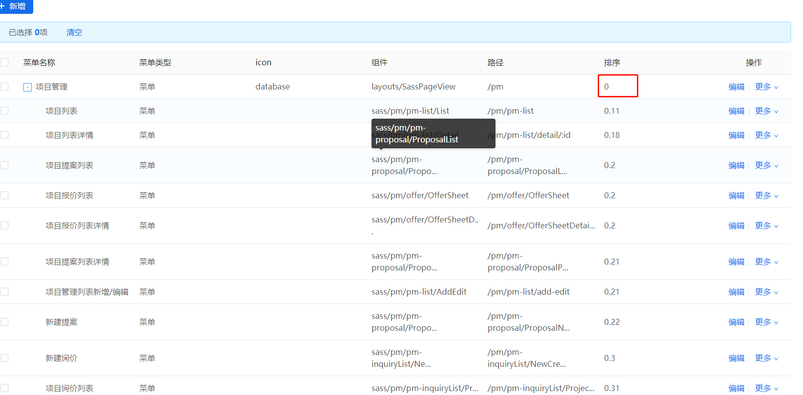
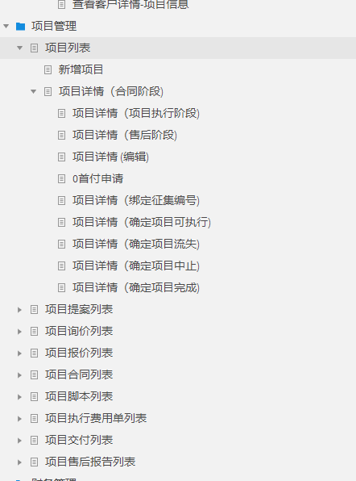

# 前端规范

## 命名

### 1.文件夹命名

> 采用小写方式，当有以复数名字时，以中划线—分隔

::: tip 例子

- head-search / page-loading / authorized / notice-icon
  :::

### 2.文件命名

> 全部采用小写方式， 以中划线-分隔，\*.vue 文件除外，vue 文件采用驼峰首字母大写方式

::: tip 例子

- render-dom.js / signup.css / index.html / company-logo.png
- List.vue / UserList / ProjectManageList
  :::

### 3.注意点

::: warning 命名（这个适用于所有命名，文件，文件夹，变量，函数等）

1. 名字的单词不要超过三级，ProjectManageList 这种已经是极限
2. 命名严禁使用拼音与英文混合的方式，更不允许直接使用中文的方式
3. 杜绝完全不规范的缩写，避免望文不知义
   :::
   ::: danger 错误示范

- vue 文件：MyProjectManageList.vue
- 文件夹/文件名：my-project-add-edit
- AbstractClass“缩写”命名成 AbsClass；condition“缩写”命名成 condi
  :::

## Css/Sass 规范

::: tip 注意点

1. 类名使用小写字母，以中划线分隔
2. 称总是使用可以反应元素目的和用途的名称，或其他通用的名称，代替表象和晦涩难懂的名称

```css
/* 不推荐 */
.fw-800 {
  font-weight: 800;
}
.red {
  color: red;
}
/* 推荐 */
.heavy {
  font-weight: 800;
}
.important {
  color: red;
}
```

3. 名称中划线-连接最多三级，不可超过三级
4. css 选择器中避免使用标签名，实在要用要配合直接子选择器

```css
.content > .title {
  font-size: 2rem;
}
```

5. scss 中的变量、函数、混合、placeholder 采用驼峰式命名
6. 尽量使用缩写属性

```css
/* 不推荐 */
padding-bottom: 2em;
padding-left: 1em;
padding-right: 1em;
padding-top: 0;
/* 推荐 */
padding: 0 1em 2em;
```

7. 每个选择器及属性独占一行

```css
.primary-button {
  width: 100px;
  height: 50px;
  color: #fff;
  background: #00a0e9;
}
```

8. 省略 0 后面的单位

```css
.title {
  padding-bottom: 0;
  margin: 0;
}
```

9. 避免使用 ID 选择器及全局标签选择器防止污染全局样式,尽可能使用 class
10. <font color=red>避免嵌套层级过多，最多三层嵌套</font>

:::

## Javascript 规范

::: tip 注意点

1. 方法名、参数名、成员变量、局部变量都统一使用小写驼峰命名
2. method 方法命名必须是 动词 或者 动词+名词 形式
3. 增删查改，详情 ———命名可以参照下面的 5 个单词

```js
add / update / delete / detail / get
```

4. 尽量使用 ES6,ES7 语法，不要用 var 这些
5. 条件判断和循环最多三层
6. console.log，debugger 等调试使用的代码用完一定要删除
   :::

## Vue 项目规范

### 组件规范

::: tip 注意点

1. 组件名为多个单词，组件名应该始终是多个单词组成（大于等于 2），如 TodoItem.vue
2. 基础组件文件名为 common 开头，使用完整单词而不是缩写，如 CommonTable.vue
3. 和父模块/目录下紧密耦合的子组件，应该以父名作为前缀命名
   > 这个尽量实现，因为考虑名字三级的缘故，有时候不太好实现可以适当调整

```js
components/todo/
|- TodoList.vue
|- TodoListItem.vue
|- TodoItemButton.vue
```

4. 组件的 data 必须是一个函数

```js
export default {
  data() {
    return {
      name: 'jack',
    };
  },
};
```

5. <font color=red>Prop 定义应该尽量详细</font>

- 必须使用 camelCase 驼峰命名
- 必须指定类型
- 必须加上注释，表明其含义
- 必须加上 required 或者 default，两者二选其一
- 如果有业务需要，必须加上 validator 验证
- 属性可以分离就分离，不要一直就用一个 Object 处理，这样不太好控制属性类型和默认值
- 当然一个组件属性也不要过分多，这个需要自己把控，哪些用 Object，哪些不用，属性个数控制在 9 个以内

```js
props: {
  // 组件状态，用于控制组件的颜色
   status: {
     type: String, // 这个必须
     required: true,
     validator: function (value) {
       return [
         'succ',
         'info',
         'error'
       ].indexOf(value) !== -1
     }
   },
    // 用户级别，用于显示皇冠个数
   userLevel：{
      type: String,
      required: true
   },
   count: {
       type: Number,
       default: 0
   },
   message: {
       type: Object,
       default: ()=>({name:'ggn'})
   }
}
```

6. 为组件样式设置作用域（如果需要深层样式使用 >>> 和 ::v-deep）

```js
<template>
  <button class="btn btn-close">X</button>
</template>

<!--深层样式,css使用 >>>，scss使用 ::v-deep -->
<!-- 使用 `scoped` 特性 -->
<style scoped>
  .btn-close {
    background-color: red;
  }
</style>
```

7. 模板中使用简单的表达式（逻辑的运算使用计算属性或者过滤器 filter）

```js
<template>
  <p>{{ normalizedFullName }}</p>
</template>

// 复杂表达式已经移入一个计算属性
computed: {
  normalizedFullName: function () {
    return this.fullName.split(' ').map(function (word) {
      return word[0].toUpperCase() + word.slice(1)
    }).join(' ')
  }
}
```

8. 指令都使用缩写形式,用 : 表示 v-bind: 、用 @ 表示 v-on: 和用 # 表示 v-slot:
9. 标签顺序保持一致

```js
<template>...</template>
<script>...</script>
<style>...</style>
```

10. 必须为 v-for 设置键值 key,key 值有唯一值的使用唯一值，不要用 index，<font color=red>特别是增删改的结构，不准用 index 作为 key</font>，如果仅仅是展示列表，又没有唯一值可以用 index 替代

11. v-show 与 v-if 选择

    > 如果运行时，需要非常频繁地切换，使用 v-show ；如果在运行时，条件很少改变，使用 v-if

12. script 标签内部结构顺序

    > components > props > data > computed > watch > filter > 钩子函数（钩子函数按其执行顺序） > methods

13. <font color=red>不要手动操作 DOM,实在要操作可以先考虑 ref 能不能实现需求</font>

:::

### 注释规范

::: tip Vue 文件

1. 头部注释，对该文件进行说明，组件/页面

- 通用功能性组件介绍该组件的功能，比如：通用的 table 配合分页
- 业务组件，介绍该组件 哪个模块/哪个页面/区域组件简述
- 页面，介绍该页面是 哪个模块/哪个页面

2. methods 函数注释，使用/\*\*/，包括日期，描述，参数，返回值，编辑者信息

##### <font color=red>上面的头部注释和函数注释会使用 vscode 插件 [koroFileHeader](/tool/#korofileheader-的配置)，规定模板统一快捷键注释</font>

3. data 函数里面的变量和 computed 计算属性

   > 每个变量都要注释，用 // 注释内容 这种简单的模式就好

4. import 引入，不管是项目内组件，本地图片，还是第三方插件等都要做简单介绍
5. template 内部注释，分区块进行注释，用<!--注释内容-->的模式，至于区块内部自己斟酌

```js
<template>
   <!--头部导航-->
   <div></div>
   <!--中间内容区-->
   <div class="user-info"></div>
   <!--底部链接-->
   <div class="footer"></div>
</template>
```

:::

::: tip Js 文件 | Css/Scss 文件/Vue 文件里面的 style 区域

1.  Js 文件

- 里面的函数使用上面所说的函数注释
- 变量就用简单的 // 注释内容 即可
- import 引入 要在后面用 // 注释内容 进行简单的阐述
- 过滤器和指令就用上面函数注释方式，有参数介绍参数
- 接口 api 的话，直接 // 注释内容 即可， （因为每个模块都是特定的 js，所以不用加模块说明）模板是：页面/接口功能介绍

2.  Css/Scss 文件/vue 文件里面的 style 区域 只要分区块进行简单的注释即可
:::

### Vue 项目目录规范

:::tip 页面 views/sass/**

1. 页面目录要遵循产品的结构,目录都是小写，复数用-隔开，具体页面还是大写驼峰的格式

``` js
// 项目管理/项目询价列表/新增编辑页面，详情页面,列表页面

views/sass/pm/pm-enquiry
|-addEdit.vue
|-Detail.vue
|-List.vye
```

:::

:::tip 页面 sass/components/**

1. 业务组件路径要参照上面的页面路径，实现统一

``` js
// 项目管理/项目询价列表/新增编辑页面，详情页面,列表页面

// /sass/components是项目的组件的根目录

sass/components/pm/pm-enquiry
|-add-edit
  |-xxx.vue
  |-xxxx.vue
|-detail
  |-xxx.vue
  |-xxxx.vue
|-list
  |-xxx.vue
  |-xxxx.vue
  |-xxxxx.vue
```
2. <font color=red>/sass/components/common里面都是通用全局组件，不用局部引入，可以直接使用</font>
> 这里面一般都是通用的，比如Table，级联， Tabs，Upload，Dialog，Input等。  
> 为何会有这么多通用组件，第三方ElementUI不是有么？
>> 公司UI和第三方组件UI还是有区别的，颜色，字体大小，背景色等，第三方可以提供功能给与我们便利，我们可以将功能进行组合，样式进行调整，封装成适合公司需要的通用组件

:::

### 接口api规范

::: tip <font color=red>接口api所在目录： @sass/api/**</font>

1. 里面每个js文件就是一个模块，比如项目管理叫pm.js

2. 每个js文件里面用注释进行分割下面的模块，比如项目管理下的项目提案，项目询价

3. 每个js文件里面方法不能重名，所以命名推荐是包含此子模块的名字，比如提案proposal

```js
// pm.js
// 左边十个-,右边十个-,中间两个-

/*----------项目提案--start----------*/
export const getProposalList = (data) => postAction('/saas/project/proposalList', data)
xxxxxxxxx
/*----------项目列表--end----------*/

/*----------项目询价--start----------*/
xxxxxxxxx
/*----------项目询价--end----------*/
```

:::

## Vue Router 规范

:::tip 路由

1. 编程式导航（遵循下面三种方式）

```js
// 命名的路由 -> /user/123
router.push({ name: 'user', params: { userId: '123' } });

// 带查询参数，变成 /register?plan=private
router.push({ path: 'register', query: { plan: 'private' } });

router.push({ path: `/user/${userId}` }); // -> /user/123
```

2. router 中的 path,name 命名规范

- path 所有字母小写，复数用-进行隔开，必须以 / 开头，即使是children里的path也要以 / 开头
- path 的路径要遵循前端页面在项目中的位置进行定义，方便找到

```js
 // 比如项目管理询价模块
 // 列表 页面路径 views/pm/pm-enquiry/list/Index.vue
 {
   path: "/pm/pm-enquiry/list",
   name: "pm_pm-enquiry_list",
 }
 //  详情 页面路径 views/pm/pm-enquiry/detail/Index.vue
 {
   path: "/pm/pm-enquiry/detail",
   name: "pm_pm-enquiry_detail",
 }
```

- name 的命名要根据 path 进行定义，用\_下划线隔开

3. 菜单管理的排序

- 目前项目管理默认是0，后面的模块都依次0.1x（项目列表）, 0.2x（项目提案列表）, 0.3x（项目询价列表）
- 项目列表模块里面区分页面，比如列表，新增/编辑，详情就是 0.11，0.12，0.13





  :::

## 图片访问操作方式（Ali-OSS）

- 如何进行url的控制，详细请访问 [阿里的图片处理操作方式](https://help.aliyun.com/document_detail/44686.html)
- url后面的参数param_value具体类型，访问  [处理参数](https://help.aliyun.com/document_detail/183902.htm?spm=a2c4g.11186623.2.8.21374981H4TFLK#section-tx1-qtj-ar8)