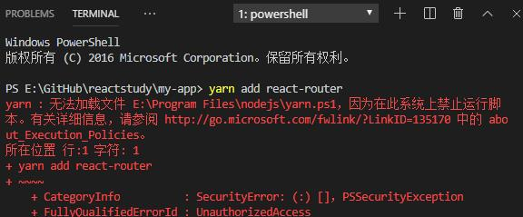

# 前端环境的配置

## 基本工具的安装
- Node.js 的安装 → [官网链接](https://nodejs.org/zh-cn/download/)
- git 的安装 → [下载地址](https://git-scm.com/downloads)
- cnpm || yarn 的安装
> [cnpm淘宝镜像](https://developer.aliyun.com/mirror/NPM?from=tnpm)【这是详细描述】  
> [yarn下载地址](https://yarn.bootcss.com/docs/install/#windows-stable)  
> cnpm只需要在powershell里面运行下面指令即可：  
>> 在一个文件夹下，按住shift，右击鼠标，就能打开基于当前文件夹的powershell  
>> 指令：npm install -g cnpm --registry=https://registry.npm.taobao.org  
  
- vscode 的安装 → [vscode下载地址](https://code.visualstudio.com/)

## cnpm || yarn安装后运行时候的问题
因为在此系统上禁止运行脚本报错  

  
- 打开windows的搜索，输入powershell，找到windows PowerShell，右击管理员身份运行
- 输入命令： set-ExecutionPolicy RemoteSigned
- 按照界面意思 输入 Y，然后就可以运行cnpm || yarn的指令了

## 拉取前端git库的代码
- 找相关人员【缪冬冬】配置git的权限
- git clone [git地址](http://10.168.1.186:8081/lujie/datashow.git) 进行代码拉取
- 需要的话 可以配置ssh
- git checkout develop 切换到develop分支进行开发

## 配置开发环境
- 进入到datashow【项目目录】
- 在当前目录按住shift，鼠标右击，点击【在此处打开powershell窗口】
- 安装项目需要的依赖  yarn || npm install || cnpm install  【三种方式自己选择】，会出现node_modules文件夹
- 开发环境运行命令 → 在powershell窗口中  yarn serve || npm run serve || cnpm run serve   【三种方式自己选择】
- 打包运行命令 → 在powershell窗口中 yarn deploy || npm run deploy || cnpm run deploy 【三种方式自己选择】

## 测试环境的部署
- 找相关人员【缪冬冬】配置jenkins的权限
- 执行前，先确认项目中是否存在dist文件夹,dist里的就是打包后的文件
- 然后打开[jenkins的地址](http://10.168.1.186:8082/)，定位 前端分支：datashow-demo，点击下拉，执行Build Now即可

## 后端人员配置本地前端
- 同样 Nodejs必须安装，配置下淘宝镜像cnpm
- git clone 前端的项目，放到本地的文件夹
- 进入到项目根目录，运行cnpm install安装依赖，可参考【配置开发环境】
- 修改根目录下的【vue.config.js】里面的proxy(代理)，改成你本地的接口地址【http://127.0.0.1/port(端口)】
- 运行cnpm run serve, 启动项目，就可以看到效果了

