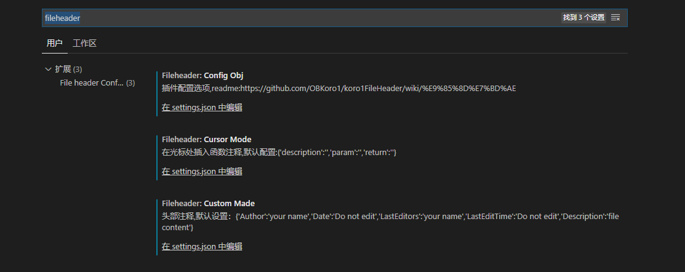

# 前端开发工具 VsCode

## 安装的插件

- Auto Close Tag
- Auto Rename Tag
- ESLint
- koroFileHeader(用于注释)
- Prettier
- Vetur

## koroFileHeader 的配置

> 打开文件 → 首选项 → 设置 → 搜索 fileheader → 在下面的 setting.json 里面随便点击进入一个 → 下面 json 里面的配置，进行替换和添加

```js
{
   // 自动添加头部注释关闭
   "fileheader.configObj": {
    "autoAdd": false
  },
  // 文件头部注释
  "fileheader.customMade": {
    "author": "lujie",
    "Date": "Do not edit",
    "LastEditTime": "Do not Edit",
    "FilePath": "Do not edit",
    "descripttion": "[desc]",
    "editor": "[your git name]"
  },
  //函数注释
  "fileheader.cursorMode": {
    "Date": "Do not edit",
    "description": "[desc]",
    "param": "",
    "editor": "[your git name]",
    "return": "[return value]"
  },
}
```



- 使用方法：
  > <font color=green>**ctrl+alt+i**</font> 是头部注释，对应上面的 fileheader.customMade  
  > <font color=green>**ctrl+alt+t**</font> 是函数注释，对应上面的 fileheader.cursorMode
